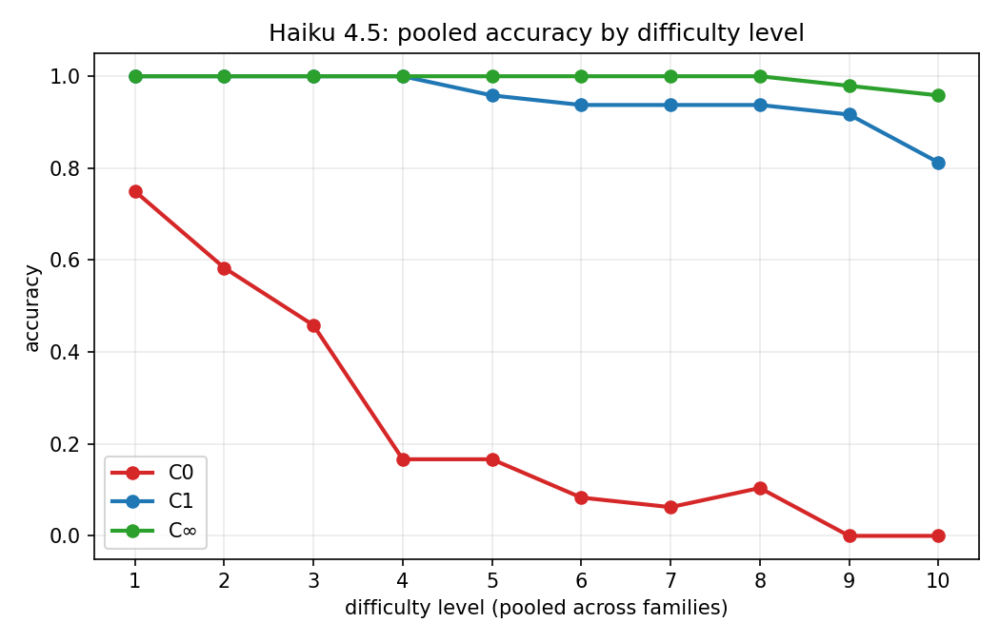

# Hard Problems Are Easy to Find

Procedurally generated problems that are **easy to state, easy to verify, and solvable by ten lines of Python — but hard for LLMs to solve by thinking**. This project generates such problems at parametric difficulty, runs models against them under three execution conditions, and asks what the pattern of failures says about the architecture of current language models.

> **⚠️ All results in this repository are preliminary.** Everything so far comes from one small model (Claude Haiku 4.5) at temperature 0 on six problem families. Nothing has been replicated across models, and the difficulty grids stop where our exact reference solvers stop. Treat the numbers as a pilot, not a finding.

## The idea

Complexity theory makes hard problems cheap to manufacture: iterate a chaotic map, find a short tour, satisfy a formula, trace a cellular automaton. We generate these with known ground truth and score models under three conditions:

- **C0** — think only: the model answers from the prompt, no tools.
- **C1** — write one Python program: we execute it in a sandbox, its stdout is scored. No feedback, no retry.
- **C∞** — interactive Python tool: the model runs code, sees output, and iterates (≤10 calls).

The contrast between conditions is the instrument. If a model fails C0 but passes C1 on the same instance, it understood the problem perfectly — it just couldn't do the computation internally. Where even C1 fails but C∞ succeeds, one-shot code wasn't enough either. Where *nothing* helps, something more interesting is going on.

## Preliminary results (Experiment 1)

Haiku 4.5, six families × ten difficulty levels × eight seeds, identical instances across conditions:

| Condition | Pooled accuracy |
|---|---|
| C0 (think) | 23.8% |
| C1 (one program) | 95.0% |
| C∞ (interactive) | 99.4% |

The C0 cliffs arrive absurdly early — one logistic-map iteration, a 6×6 maze, 7-variable 3-SAT — and of 480 paired instances, 343 flipped from C0-fail to C1-pass against exactly 1 in the reverse direction. The one family where C1 lagged C∞ (TSP) failed by committing one-shot to a heuristic rather than iterating. Details, caveats, and transcripts: [docs/EXPERIMENT_1.md](docs/EXPERIMENT_1.md) and `experiments/exp1/`.



## Documentation

Start with the design doc, then follow your interests:

**Core design**
- [DESIGN.md](docs/DESIGN.md) — thesis, scope, phasing
- [PROBLEMS.md](docs/PROBLEMS.md) — problem-family brainstorm and taxonomy of hardness sources
- [ARCHITECTURE.md](docs/ARCHITECTURE.md) — the implementation contract for problem families (determinism, testing, scoring)
- [HARNESSES.md](docs/HARNESSES.md) — why Inspect AI
- [HYPOTHESES.md](docs/HYPOTHESES.md) — pre-registered predictions (H1–H12, frozen before any runs, plus Andrew's A1–A4)
- [QUESTIONS.md](docs/QUESTIONS.md) — decision log

**Results so far**
- [EXPERIMENT_1.md](docs/EXPERIMENT_1.md) — difficulty-response curves under C0/C1/C∞ (preliminary)

**Research directions (design docs, not yet run)**
- [DIMENSIONS.md](docs/DIMENSIONS.md) — axes of problem variation beyond scalar difficulty
- [C1_CINF_GAP.md](docs/C1_CINF_GAP.md) — when one-shot code fails but iterated code succeeds: mechanism taxonomy and proposed families
- [A1_SCALING_STUDY.md](docs/A1_SCALING_STUDY.md) — which training factor (params, depth, data quantity, data quality) moves the cliffs, with [feasibility](docs/A1_SCALING_FEASIBILITY.md) and [inference engineering](docs/A1_INFERENCE_PLAN.md) companions
- [A3_TACIT_OBJECTIVES.md](docs/A3_TACIT_OBJECTIVES.md) — problems where the knowledge needed lives in the model's weights and code can't rescue thinking, with a [problem brainstorm](docs/A3_PROBLEM_BRAINSTORM.md)

**Literature**
- [LITERATURE.md](docs/LITERATURE.md) — transformer expressivity, empirical reasoning limits
- [VARIATION_DIMENSIONS_LIT.md](docs/VARIATION_DIMENSIONS_LIT.md) — survey of problem-variation axes in 2024–2026 benchmarks

## Quickstart

```bash
pip install -e ".[dev]"
pytest                      # unit tests for all problem families

# generate and render an instance
python -c "
from hard_problems.core import get_family
fam = get_family('maze')
inst = fam.generate(seed=1, size=6)
print(fam.render(inst))
"
```

Running evaluations requires [inspect-ai](https://inspect.aisi.org.uk/) and (for C1/C∞) Docker for the sandbox; see `src/hard_problems/adapters/inspect_ai.py` and `sandbox/compose.yaml`. Experiment specs and analysis live in `experiments/`.

## Layout

```
src/hard_problems/      core abstractions + six problem families (stdlib-only, deterministic)
  adapters/inspect_ai.py  Inspect AI tasks for C0 / C1 / C∞ / oracle conditions
tests/                  per-family unit tests, golden snapshots, adapter tests
experiments/exp1/       grid spec, analysis script, plots, summary CSVs
calibration/            difficulty calibration artifacts (Haiku 4.5, C0)
docs/                   all design docs (see above)
logs/                   Inspect eval logs for all runs
sandbox/                Docker sandbox for model-written code
```

## License

MIT — see [LICENSE](LICENSE).
